# Lab 1: Introduction to High-Level Synthesis

Author: Yuqi He

## PART I: Vector Addition Example

`pl_vecadd.cpp`

``` c ++
#include "ap_int.h"
#include "ap_fixed.h"
#include "hls_math.h"

void pl_vecadd(float a[1024], float b[1024], float c[1024])
{
  #pragma HLS INTERFACE m_axi port=a offset=slave bundle=data0
  #pragma HLS INTERFACE s_axilite register port=a bundle=ctrl
  #pragma HLS INTERFACE m_axi port=b offset=slave bundle=data1
  #pragma HLS INTERFACE s_axilite register port=b bundle=ctrl
  #pragma HLS INTERFACE m_axi port=c offset=slave bundle=data2
  #pragma HLS INTERFACE s_axilite register port=c bundle=ctrl
  #pragma HLS INTERFACE s_axilite register port=return bundle=ctrl
  for (int i = 0; i < 1024; i += 1)
  {
    #pragma HLS pipeline
    c[i] = a[i] + b[i];
  }

}
```


### Vitis HLS synthesis summary

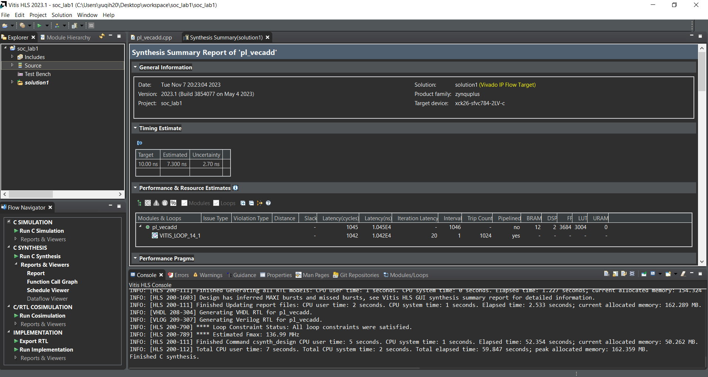

**Latency(Cycles):** 1045

**Latency(ns):** 1.045E4

**LUT:**3004


### Vivado post-implementation summary

**Block Design:**

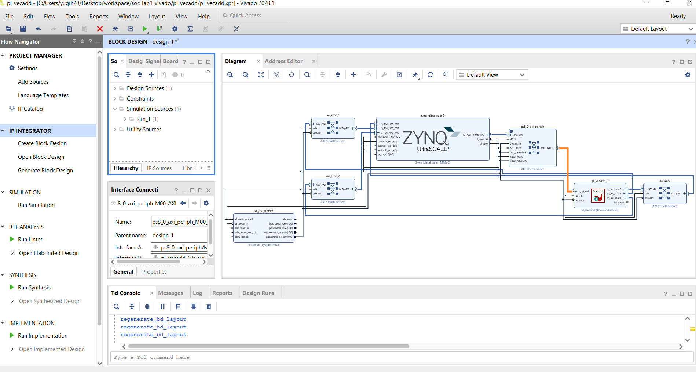

**Runs:**

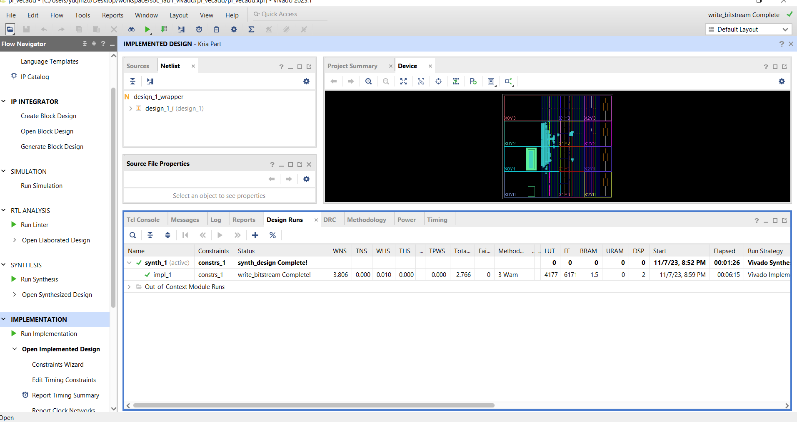

**Timing:**

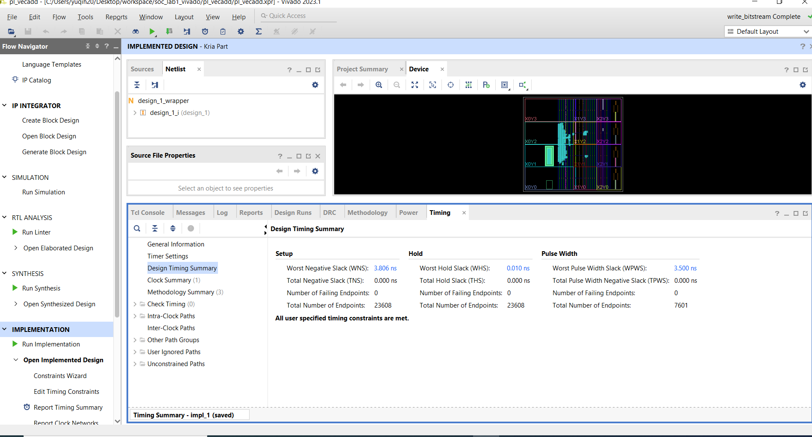

**Power:**

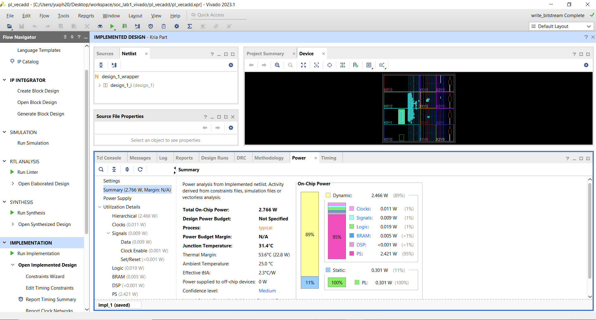


## PART II: Matrix Multiplication

### Plain:

`matmual_plain.cpp`

``` c++
#include "ap_int.h"
#include "ap_fixed.h"
#include "hls_math.h"

#define M 16
#define K 16
#define N 16

void matmul_plain(int A[M][K], int B[K][N], int AB[M][N]) {
	#pragma HLS INTERFACE m_axi port=A offset=slave bundle=data0
	#pragma HLS INTERFACE s_axilite register port=A bundle=ctrl
	#pragma HLS INTERFACE m_axi port=B offset=slave bundle=data1
	#pragma HLS INTERFACE s_axilite register port=B bundle=ctrl
	#pragma HLS INTERFACE m_axi port=AB offset=slave bundle=data2
	#pragma HLS INTERFACE s_axilite register port=AB bundle=ctrl
	#pragma HLS INTERFACE s_axilite register port=return bundle=ctrl


    for (int i = 0; i < M; i++) {
        for (int j = 0; j < N; j++) {
            int sum = 0;
            for (int k = 0; k < K; k++) {
                sum += A[i][k] * B[k][j];
            }
            AB[i][j] = sum;
        }
    }
}
```


#### Vitis HLS synthesis summary

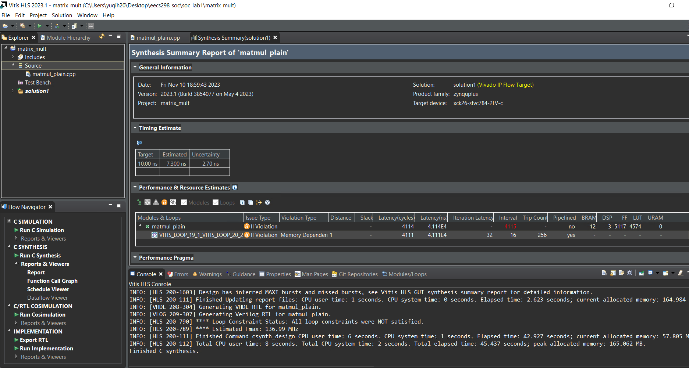

**Latency(Cycles):** 4114

**Latency(ns):** 4.114E4

**LUT:**4574


#### Vivado post-implementation summary

**Block Design:**

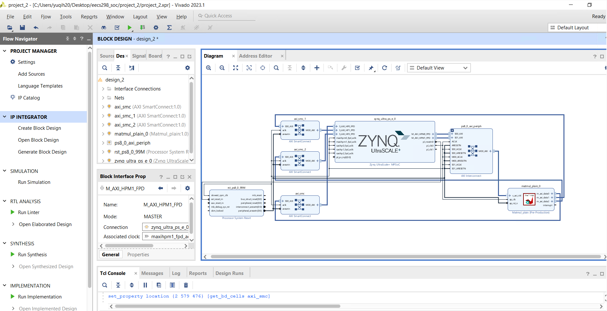

**Runs:**

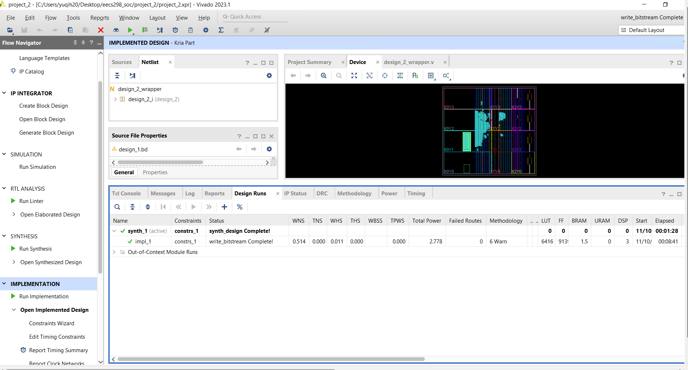

**Timing:**

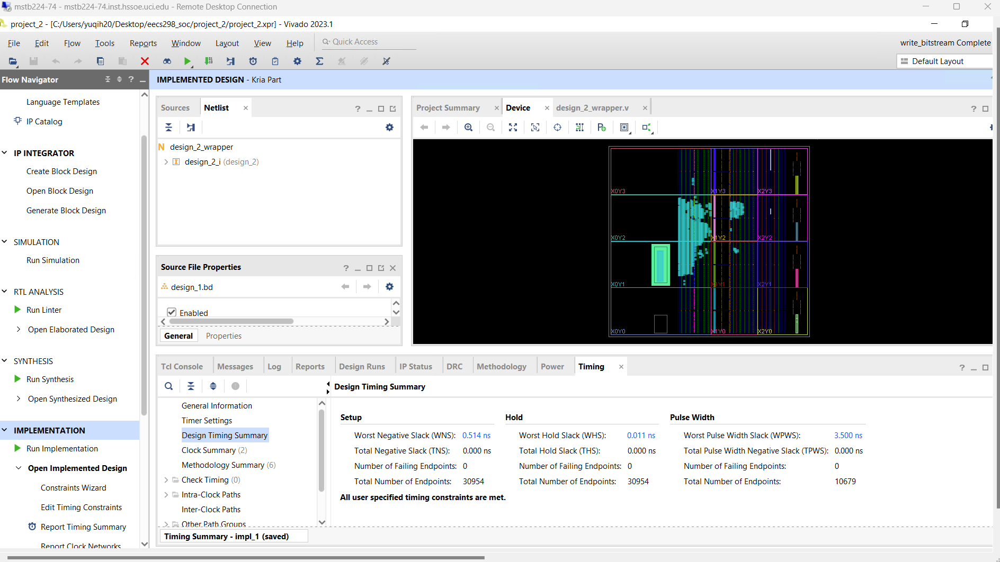

**Power:**

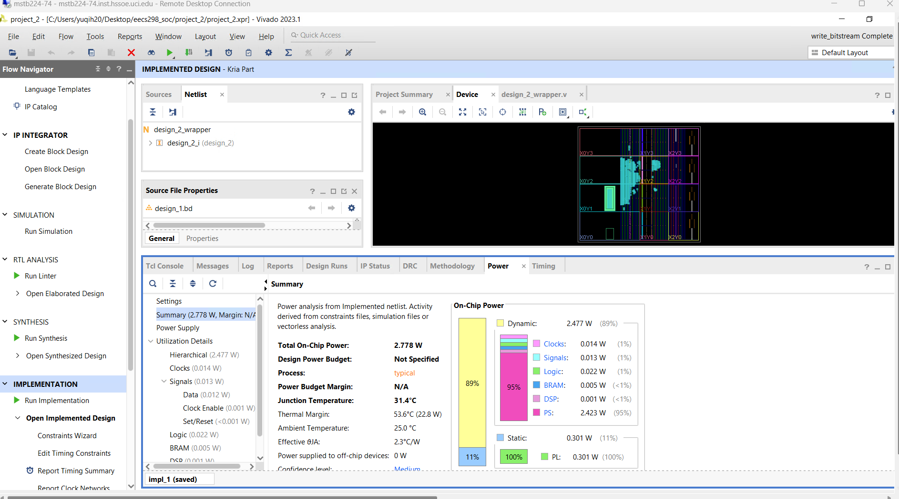


### Optimized:

`matmul_optimized.cpp` 

``` c++
#include "ap_int.h"
#include "ap_fixed.h"
#include "hls_math.h"

#define M 16
#define K 16
#define N 16

void matmul_optimized(int A[M][K], int B[K][N], int AB[M][N]) {
    #pragma HLS INTERFACE m_axi port=A offset=slave bundle=data0
    #pragma HLS INTERFACE s_axilite port=A bundle=ctrl
    #pragma HLS INTERFACE m_axi port=B offset=slave bundle=data1
    #pragma HLS INTERFACE s_axilite port=B bundle=ctrl
    #pragma HLS INTERFACE m_axi port=AB offset=slave bundle=data2
    #pragma HLS INTERFACE s_axilite port=AB bundle=ctrl
    #pragma HLS INTERFACE s_axilite port=return bundle=ctrl


    #pragma HLS ARRAY_PARTITION variable=A complete dim=2
    #pragma HLS ARRAY_PARTITION variable=B complete dim=1

    // Main matrix multiplication loop
    for (int i = 0; i < M; i++) {
        for (int j = 0; j < N; j++) {
            #pragma HLS PIPELINE
            int sum = 0;
            for (int k = 0; k < K; k++) {
                sum += A[i][k] * B[k][j];
            }
            AB[i][j] = sum;
        }
    }
}
```

#### Vitis HLS synthesis summary

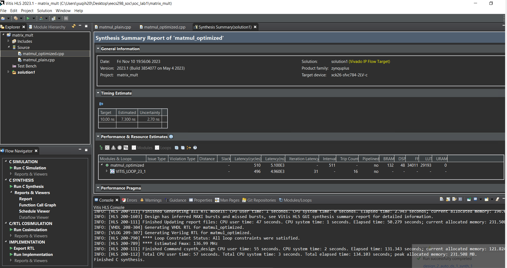

**Latency(Cycles):** 510

**Latency(ns):** 5.100E3

**LUT:**29193


#### Vivado post-implementation summary

**Block Design:**

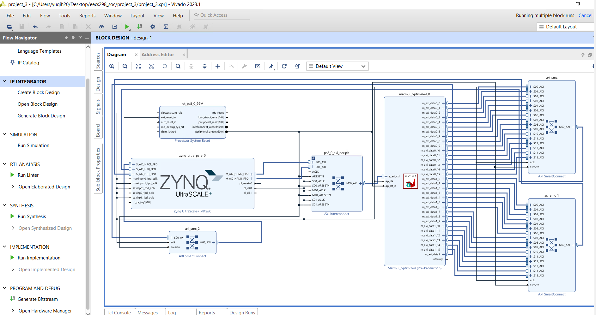

**Runs:**

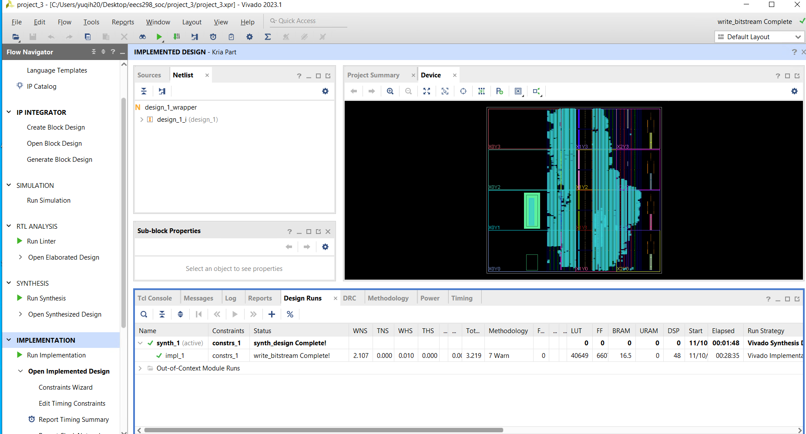

**Timing:**

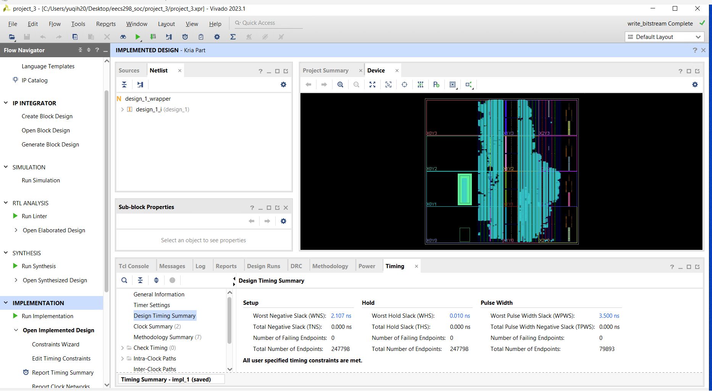

**Power:**

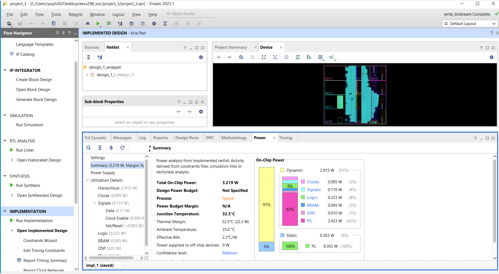


### Comparison:

**Vitis C synthesis**

| Metric           | Plain Version | Optimized Version |
| ---------------- | ------------- | ----------------- |
| Latency (Cycles) | 4114          | 510               |
| Latency (ns)     | 4.114E4       | 5.100E3           |
| LUT              | 4574          | 29193             |
| FF               | 5117          | 34011             |

**Vivado post-implementation:**

| Metric      | Plain Version | Optimized Version |
| ----------- | ------------- | ----------------- |
| WNS         | 0.514         | 2.107             |
| Total Power | 2.778         | 3.219             |
| LUT         | 6416          | 40649             |
| FF          | 9139          | 66071             |
| BRAM        | 1.5           | 16.5              |

